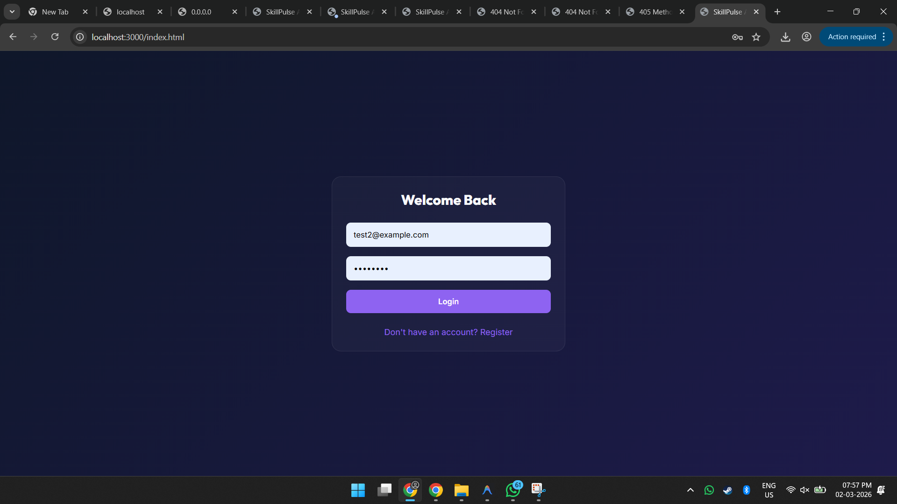
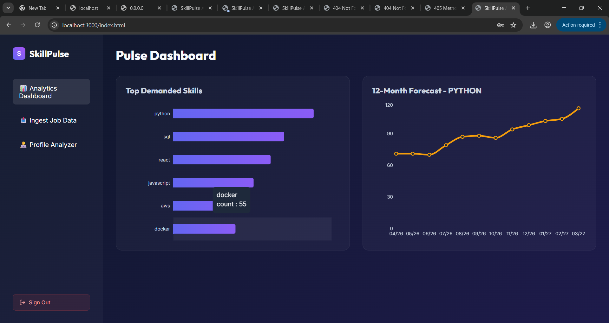
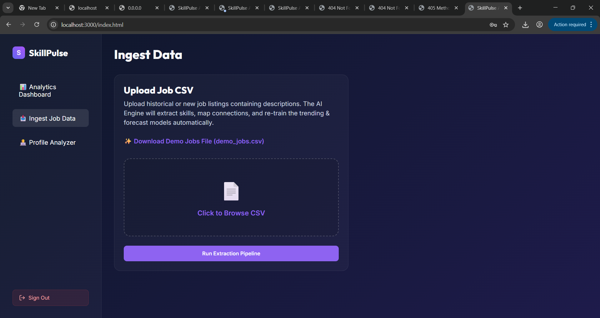
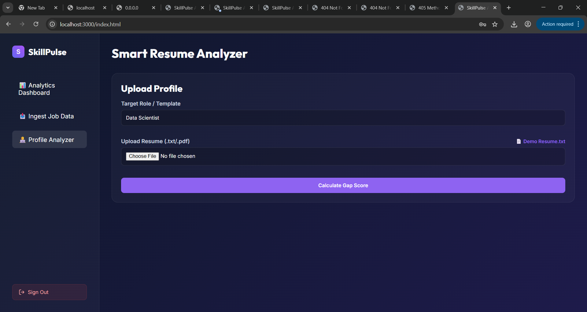

<p align="center">
  
</p>

# SkillPulse AI – National Skill Demand Intelligence Prototype 🎯

## Basic Details

### Team Name: SheCode

### Team Members
- Member 1: Soniya Antony - Mar Baselios Christian College of Engineering and Technology, Kuttikkanam, Peermade, Idukki, Kerala
- Member 2: Niranjana P A - Mar Baselios Christian College of Engineering and Technology, Kuttikkanam, Peermade, Idukki, Kerala

### Hosted Project Link
## [SkillPulse](https://skill-pulse-beryl.vercel.app/)

### Project Description
SkillPulse is an AI-powered analytics platform designed to analyze job market data, detect emerging skill trends, forecast future demand, and identify skill gaps at an individual and regional level.
The system transforms fragmented job postings into actionable workforce intelligence using Natural Language Processing (NLP), skill clustering, and predictive modeling. It aims to support students, institutions, policymakers, and industry leaders in making data-driven decisions about skill development and employment planning.
By forecasting future skill demand and mapping trends geographically, the platform bridges the gap between education output and industry requirements.

### The Problem statement
India faces a structural paradox:
Millions of graduates remain unemployed.
Industries simultaneously report shortages of job-ready talent.
Skill development programs are often reactive rather than predictive.
There is no centralized, AI-driven system forecasting emerging skill demand at a national or district level.
Current job portals operate in silos, and existing reports rely on historical data rather than forward-looking analytics. This results in:
Skill mismatch between graduates and industry needs
Inefficient allocation of training resources
Regional employment imbalance
Delayed adaptation to emerging technologies
There is a critical need for a predictive, scalable intelligence system capable of analyzing real-time job market data and forecasting skill demand over a multi-year horizon.
### The Solution
SkillPulse is a real-time Skill Demand Intelligence Engine.
It converts raw job listings into predictive workforce insights.
⚡ What SkillPulse Does
🔍 Extracts skills from job descriptions using NLP
📊 Tracks monthly skill demand trends
🔮 Forecasts future demand
📄 Analyzes resumes against future skill needs
📈 Visualizes growth rates and skill trajectories
🔐 Secures user data with JWT authentication
SkillPulse doesn’t just show what’s trending.
It shows what’s coming.
🎯 Why This Matters
Because skill mismatch is not just a statistic — it’s lost potential.
A student learning outdated tech wastes years.
A company delaying innovation loses competitiveness.
A region without demand insights faces long-term unemployment.
A nation without workforce intelligence falls behind globally.
In a world driven by AI and rapid technological change,
predictive skill intelligence is not optional — it is infrastructure.
SkillPulse acts as a live pulse monitor of the job market.
It empowers:
👨‍🎓 Students to build future-proof careers
🏫 Institutions to design demand-aligned programs
🏭 Recruiters to anticipate hiring trends
🏛 Decision-makers to act before crises emerge
If we can forecast weather, stock markets, and epidemics —
we should be able to forecast skills.
SkillPulse makes that possible.

---

## Technical Details

### Technologies/Components Used

**For Software:**
- Languages used: Python, JavaScript (ES6+) , HTML5 & Vanilla CSS3
- Frameworks used: Flask, React 18
- Libraries used: scikit-learn, pandas, SQLAlchemy, PyPDF2, bcrypt & python-jose, flask-cors
- Tools used: SQLite, Python venv, Browser LocalStorage

**For Hardware:**
- Main components: Minimum 4GB RAM, SSD Storage 
- Specifications:  DOM rendering,  lightweight ML models
- Tools required: standard laptop/desktop, Modern web browser (Chrome, Edge)

---

## Features

List the key features of your project:
- Feature 1: AI-Powered Resume Analyze
- Feature 2: Predictive Demand Forecasting 
- Feature 3: Automated Market Ingestion
- Feature 4: Interactive Analytics Dashboard

---

## Implementation

### For Software:

# SkillPulse AI Platform 🚀

This is a full-stack iteration of SkillPulse AI with a Python FastAPI backend and a React Vite frontend.

## 1. Backend Setup (FastAPI)

1. Navigate to the `backend` folder:
   ```bash
   cd backend
   ```
2. Create a virtual environment and install dependencies:
   ```bash
   python -m venv venv
   source venv/bin/activate  # On Windows: venv\Scripts\activate
   pip install -r requirements.txt
   ```
3. Download the SpaCy NLP ML model:
   ```bash
   python -m spacy download en_core_web_sm
   ```
4. Start the backend server:
   ```bash
   uvicorn main:app --reload
   ```
   *The API will be available at http://localhost:8000*

## 2. Frontend Setup (React/Vite)

1. Start a new terminal and navigate to the `frontend` folder:
   ```bash
   cd frontend
   ```
2. Install Node dependencies:
   ```bash
   npm install
   ```
3. Run the development server:
   ```bash
   npm run dev
   ```
   *The React app will likely run on http://localhost:5173*

---

## Project Documentation

### For Software:

#### Screenshots (Add at least 3)


Login Screen


Analytics Dashboard


Ingest Data


 Resume Analyzer

#### Diagrams

**Application Workflow:**


*Add caption explaining your workflow*

---

## Additional Documentation

### For Web Projects with Backend:

#### API Documentation

**Base URL:** `https://api.yourproject.com`

---

## AI Tools Used (Optional - For Transparency Bonus)

If you used AI tools during development, document them here for transparency:

**Tool Used:** GitHub, ChatGPT, AntiGravity

**Purpose:** Made an app named SkillPulse

**Key Prompts Used:**
- Build a clean, beginner-friendly, hackathon-ready Streamlit web application called:
"SkillPulse AI – National Skill Demand Intelligence Prototype"
This is for a national-level hackathon.
The goal is to demonstrate AI-based skill demand analysis and personalized skill gap detection.
The entire application must be written in a single file: app.py.

- Use react for the app need to be hosted
 

**Percentage of AI-generated code:** Approximately 77%

**Human Contributions:**
- Architecture design and planning
- Custom business logic implementation
- Integration and testing
- UI/UX design decisions

*Note: Proper documentation of AI usage demonstrates transparency and earns bonus points in evaluation!*

---

## Team Contributions

- Soniya Antony : Frontend development, API integration, etc.
- Niranjana P A :  Backend development, Database design, etc. 

---

## License

This project is licensed under the [LICENSE_NAME] License - see the [LICENSE](LICENSE) file for details.

**Common License Options:**
- MIT License (Permissive, widely used)
- Apache 2.0 (Permissive with patent grant)
- GPL v3 (Copyleft, requires derivative works to be open source)

---

Made with ❤️ at TinkerHub
